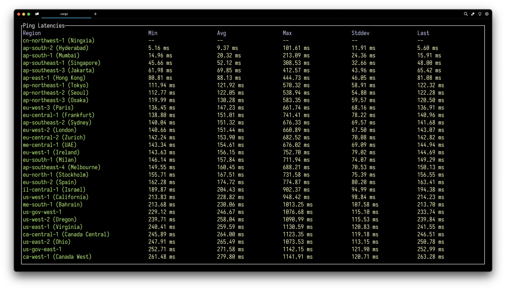

# pong



Pong is a simple CLI program that I use to ping different AWS regions. It's written in Rust and uses the `ratatui` library for for TUI.

I wrote this because I purchased a new ethernet cable and wanted to compare latency between WiFi and ethernet.

## Running `pong`

```bash
cargo run --release
```